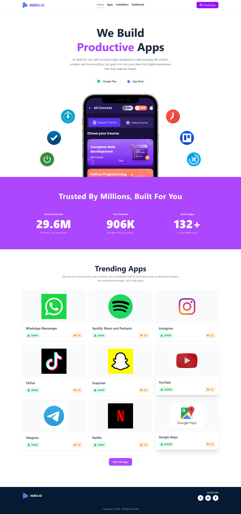
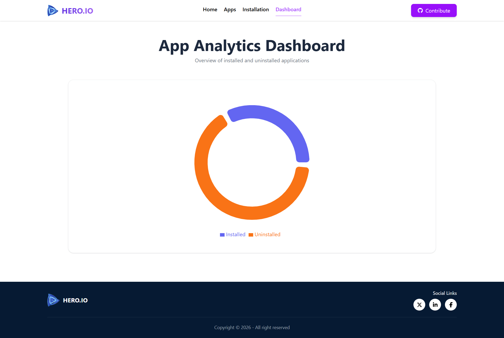
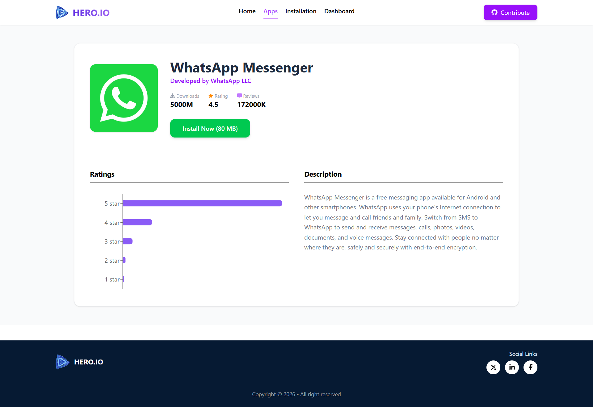
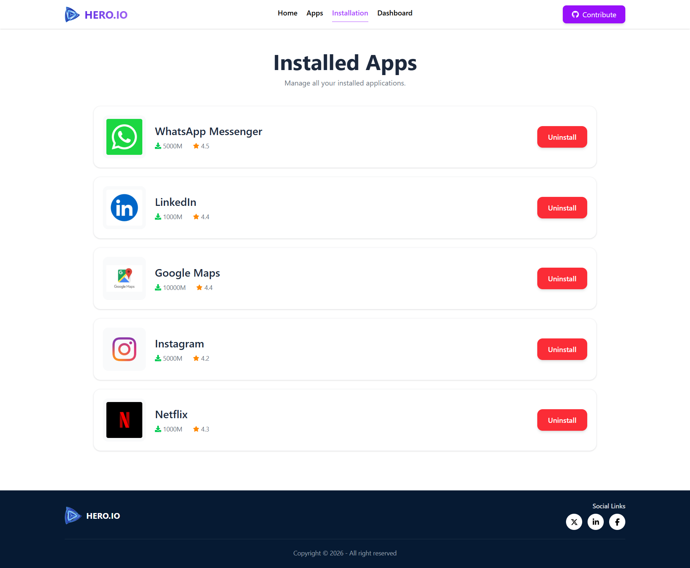
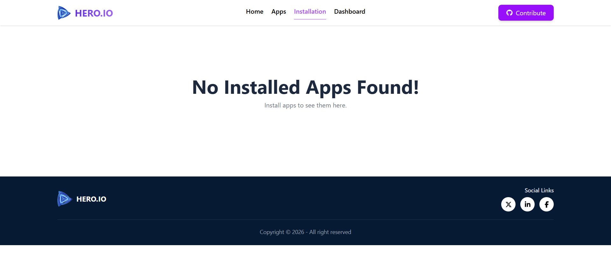

<div align="center">

# 🚀 Hero.IO Apps

### *Discover, Install, and Manage your favorite applications.*

A modern app store dashboard built with React that simulates real-world app installation, analytics, and management with a smooth and interactive user experience.


<br/>

[](https://reactjs.org/)
[](https://reactrouter.com/)
[](https://recharts.org/)
[](https://tailwindcss.com/)
[](https://fkhadra.github.io/react-toastify/introduction)
[](https://react-icons.github.io/react-icons/)

</div>

---

## 🌐 Live Demo

👉 **[View Live Project](https://hero-io-apps.netlify.app/)**

---

## 📖 Overview

**Hero.IO Apps** is a modern application management platform that simulates a real app marketplace experience. Users can explore applications, install/uninstall them, and visualize app performance through interactive analytics.

This project focuses on **state management, dynamic routing, and real-time UI updates**, delivering a production-like frontend experience.

---

## 📸 Product Showcase

### 🏠 Homepage & Discovery



A clean hero section with app discovery, platform navigation, and featured applications with live stats.

---

### 📊 Analytics Dashboard



Interactive **Recharts-based dashboard** displaying installed vs uninstalled apps with visual insights.

---

## 📦 App Lifecycle Management

<details>
<summary><strong>🔍 App Details View</strong></summary>
<br/>



> Detailed app information including ratings, metadata, and an install button with instant feedback.
</details>

---

<details>
<summary><strong>📥 Installed Apps Manager</strong></summary>
<br/>



> Manage installed applications with uninstall functionality and real-time state updates.
</details>

---

<details>
<summary><strong>💡 Empty State UI</strong></summary>
<br/>



> Clean and user-friendly empty state when no apps are installed.
</details>

---

## ✨ Key Features

- 🛠️ Dynamic app install & uninstall system  
- 📊 Interactive analytics dashboard using Recharts  
- 🔄 Persistent state across multiple routes  
- 🧭 Advanced routing with active navigation highlight  
- 🔔 Real-time toast notifications  
- 📱 Fully responsive UI across all devices  
- ⚡ Smooth transitions & loading states  
- ❌ Custom 404 error page  

---

## 🛠️ Tech Stack

| Technology | Purpose |
|------------|---------|
| React.js | Core Framework |
| React Router DOM | Navigation System |
| Recharts | Data Visualization |
| Tailwind CSS | Styling |
| React Icons | UI Icons |
| React Toastify | Notifications |
| JSON Data | Mock Backend |

---

## 💡 What I Learned

- Managing persistent state across multiple routes  
- Building real-world install/uninstall workflows  
- Transforming JSON data into meaningful charts  
- Improving UX with instant feedback systems  
- Handling loading states and UI transitions  

---

## 🚀 Getting Started

### Clone Repository

```bash
git clone https://github.com/abutalha08/hero-io-apps.git
cd hero-io-apps
npm install
npm run dev
```

---

## 📱 Responsive Design

Hero.IO Apps is fully responsive and optimized for mobile, tablet, and desktop devices, ensuring a smooth app-store-like experience across all screen sizes.

---

## 💙 Author

<div align="center">

Made with 💙 by [Abu Talha Taufique](https://github.com/abutalha08)

*Hero.IO Apps — a modern simulation of a real-world application marketplace.*

© 2026 Hero.IO Apps. All rights reserved.

</div>